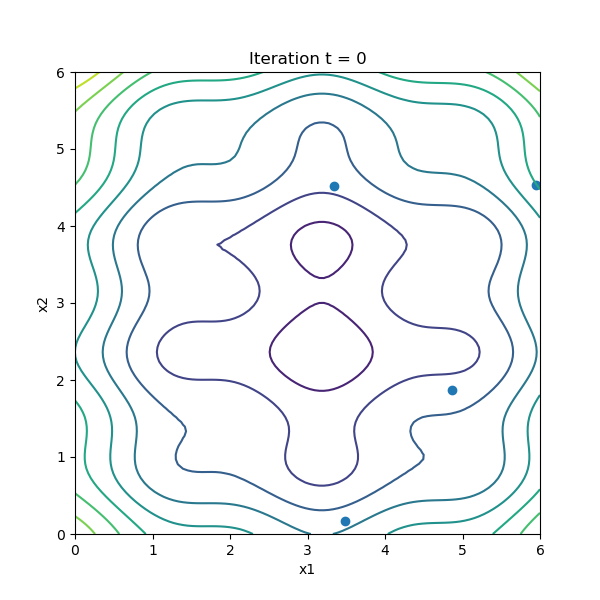
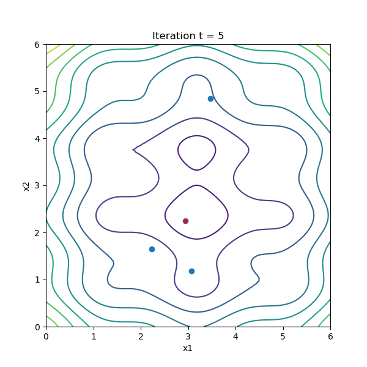
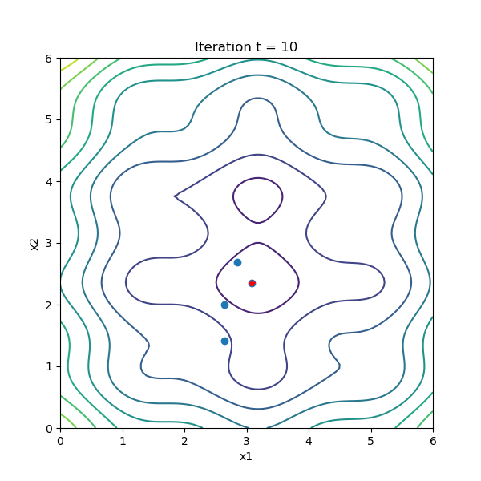
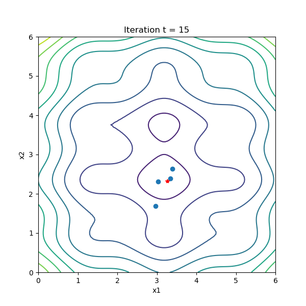
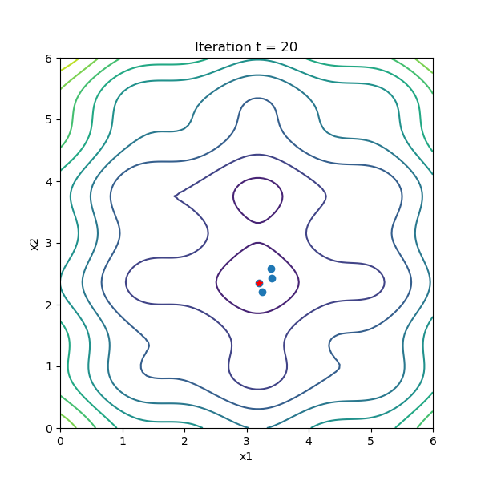

# GBest Method for a Particle Swarm Optimisation Problem

## Particle Swarm Optimisation Problem

    

Particle swarm optimization (PSO) is one of the bio-inspired algorithms and it is a simple one to search for an optimal solution in the solution space. It is different from other optimization algorithms in such a way that only the objective function is needed and it is not dependent on the gradient or any differential form of the objective. It also has very few hyperparameters.

## Algorithm

Assume we have $P$ particles and we denote of particle $i$ at iteration $t$ as $X^i(t)$, which in the example of above, we have it as a coordinate $X^i(t)=(x^i(t), y^i(t))$. Besides the position, we also have a velocity for each particle, denoted as $V^i(t)=(v^i_x(t), v^i_y(t))$. At the next iteration, the position of each particle would be updated as $$X^i(t+1)=X^i(t)+V^i(t+1)$$ or, equivalently, $$x^i(t+1)=x^i(t)+v^i_x(t+1)$$ $$y^i(t+1)=y^i(t)+v^i_y(t+1)$$ and at the same time, the velocities are also updated by the rule $$V^i(t+1)=wV^i(t)+c_1r_1(pbest^i-X^i(t))+c_2r_2(gbest-X^i(t))$$ where $r_1$ and $r_2$ are random numbers between 0 and 1, constants $w, c_1$ and $c_2$ are parameters to the PSO algorithm, and $pbest^i$ is the position that gives the best $f(X)$ value ever explored by particle $i$ and $gbest$ is that explored by all the particles in the swarm.

## Results

This shows results about the following function

$$f(x,y)=(x-3.14)^2+(y-2.72)^2+sin(3x+1.41)+sin(4y-1.73)$$

